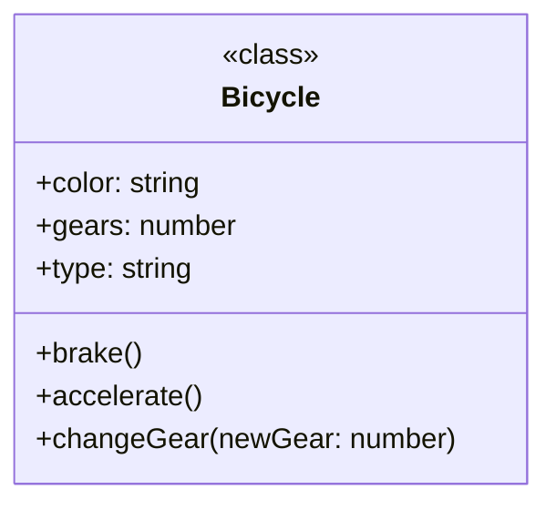
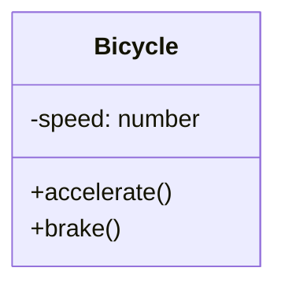
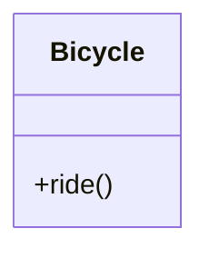
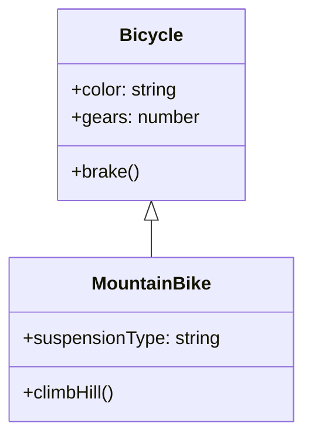
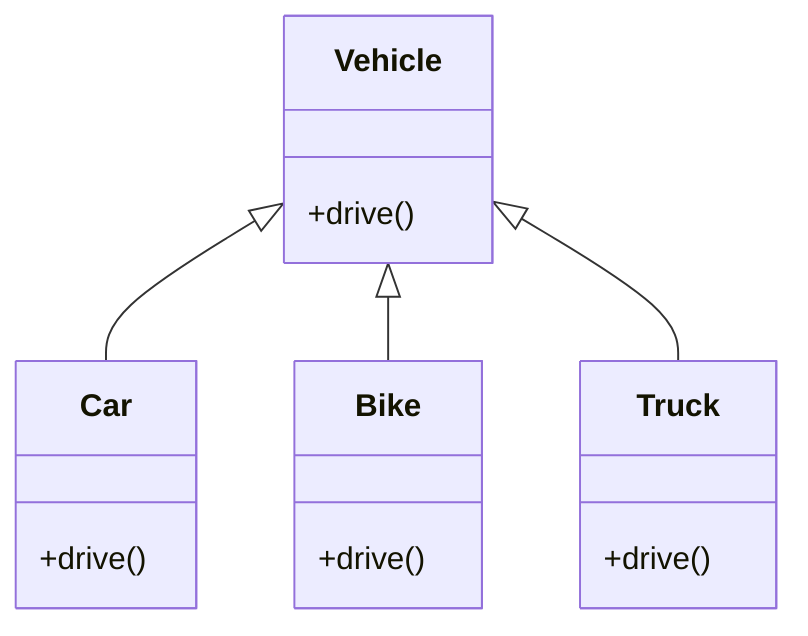

## Week 4: Object-Oriented Programming
**Step 1: Understanding Objects and Classes**.

In JavaScript, almost everything is an object! Think of an object as a container that holds information about something. This information comes in the form of **properties** (characteristics) and **methods** (actions).

**Example:**

Imagine a bicycle.  

*   Its **properties** could be its color (`"red"`), its number of gears (`21`), and its type (`"mountain bike"`). 
*   Its **methods** could be `brake()`, `accelerate()`, and `changeGear()`.

Now, a **class** is like a blueprint for creating these objects. It defines the properties and methods that objects created from it will have.

**Class Diagram:**


**Example:**

```javascript
class Bicycle {
  constructor(color, gears, type) {
    this.color = color;
    this.gears = gears;
    this.type = type;
  }

  brake() {
    console.log("Slowing down!"); 
  }

  accelerate() {
    console.log("Going faster!");
  }

  changeGear(newGear) {
    console.log(`Changing to gear ${newGear}`);
  }
}

// Creating a new Bicycle object
let myBike = new Bicycle("red", 21, "mountain bike");

myBike.accelerate(); // Outputs: "Going faster!"
```

In this example, `Bicycle` is the class, and `myBike` is an object (an instance of the `Bicycle` class). We've given `myBike` the properties `"red"`, `21`, and `"mountain bike"`. It can also perform actions like `accelerate()` thanks to the methods defined in the `Bicycle` class.

**Fun Fact:** Did you know that the first object-oriented programming language was Simula, invented in the 1960s?


**Step 2: Diving into the Four Pillars of OOP**.

These four pillars are the core principles that make object-oriented programming so powerful. They provide a framework for writing organized, reusable, and maintainable code.

**1. Encapsulation**

Think of encapsulation like a protective capsule. It's the idea of bundling data (properties) and the methods that operate on that data within a class, keeping them safe from outside interference. This helps prevent accidental modification and promotes data integrity.

**Example:**


This diagram shows that the `speed` property is private (-), meaning it can only be accessed and modified from within the `Bicycle` class itself. The methods `accelerate()` and `brake()` (which are public `+`) are responsible for managing the speed. This demonstrates encapsulation by bundling the data (`speed`) and the methods that operate on it within the class.

**2. Abstraction**

Abstraction is like a simplified user interface. It hides complex implementation details from the user, presenting only the necessary information. This makes the code easier to use and understand.

**Example:**


When you drive a car, you don't need to know how the engine works internally. You just use the steering wheel, pedals, and gear stick. That's abstraction in action!

**3. Inheritance**

Inheritance is like passing down traits from parents to children. It allows you to create new classes (child classes) from existing ones (parent classes). The child class inherits the properties and methods of the parent class, and can also have its own unique features.

**Example:**


We could create a `MountainBike` class that inherits from the `Bicycle` class. It would inherit properties like `color` and `gears`, but also have its own unique properties like `suspensionType` and methods like `climbHill()`.

**4. Polymorphism**

Polymorphism means "many forms." It allows objects of different classes to be treated as objects of a common type. This promotes flexibility and code reusability.

**Example:**


Different types of vehicles (cars, bikes, trucks) can all be used for transportation. Even though they are different classes, they can all be treated as "vehicles" in certain contexts.

**Witty Joke:** Why did the programmer quit his job? Because he didn't get arrays! 😂

